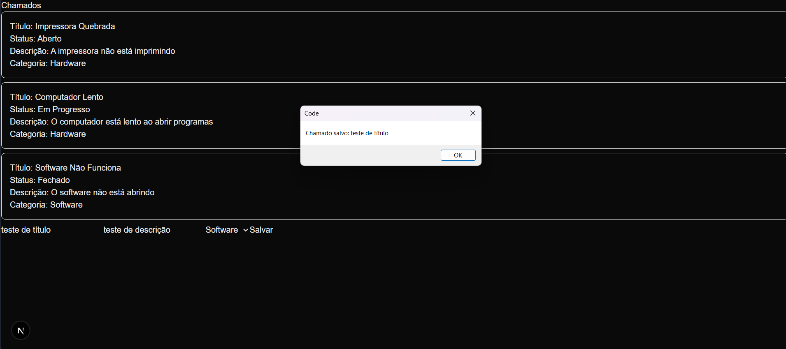
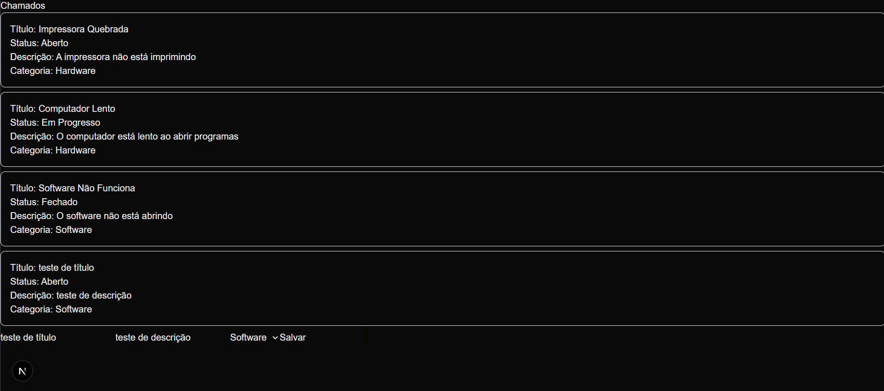
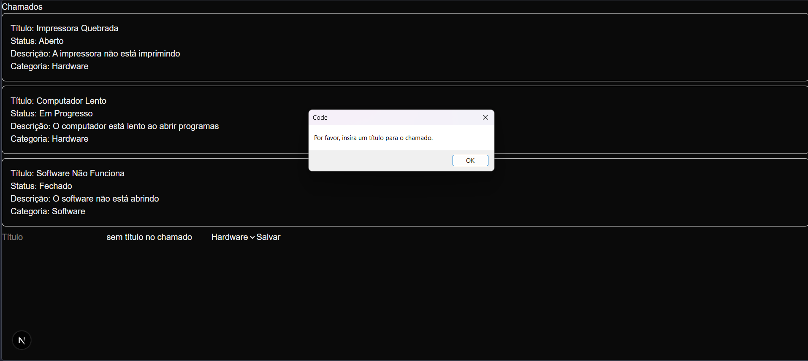

# Sistema de Chamados

Aplicação web de gerenciamento de chamados técnicos, inspirada em ferramentas como GLPI e Jira. Construída do zero com Next.js e TypeScript.

## Sobre o projeto

Sistema que permite abrir, acompanhar e resolver chamados de suporte técnico. O projeto nasceu da experiência prática com sistemas de chamados no mercado de trabalho.

## Funcionalidades

- Listagem de chamados
- Abertura de novo chamado (título, descrição e categoria)
- Validação de formulário
- Atualização de status (em andamento · resolvido)
- Autenticação com dois perfis: usuário e atendente

## Tecnologias

- Next.js 15 (App Router)
- TypeScript
- Tailwind CSS
- Supabase (banco de dados e autenticação)
- Vercel (deploy)

## Como rodar localmente

```bash
# Clone o repositório
git clone https://github.com/TalitaMoul/Sistema-Chamados.git

# Entre na pasta
cd Sistema-Chamados

# Instale as dependências
npm install

# Configure as variáveis de ambiente
# Crie um arquivo .env.local com suas chaves do Supabase

# Rode o projeto
npm run dev
```

Acesse http://localhost:3000

## Variáveis de ambiente necessárias

```
NEXT_PUBLIC_SUPABASE_URL=
NEXT_PUBLIC_SUPABASE_ANON_KEY=
```
## Screenshots




